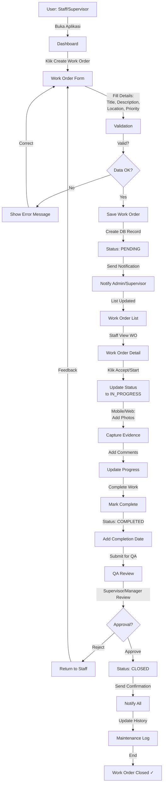
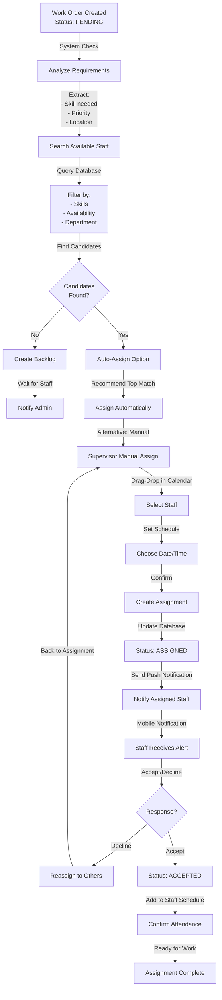
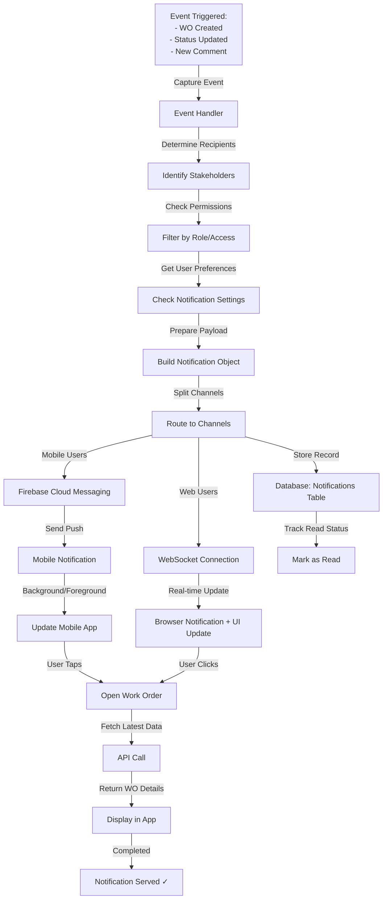
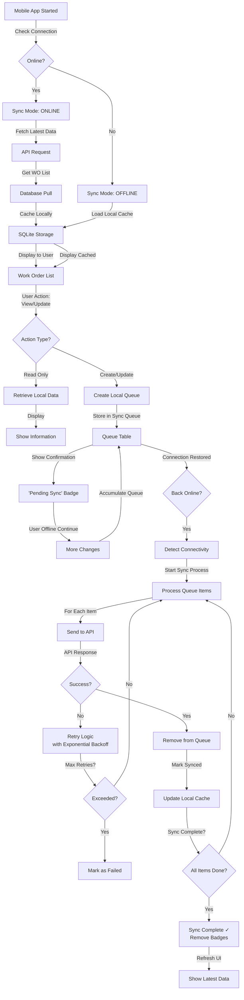
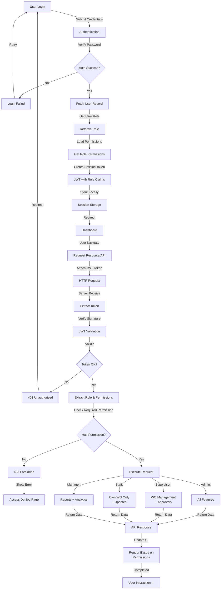
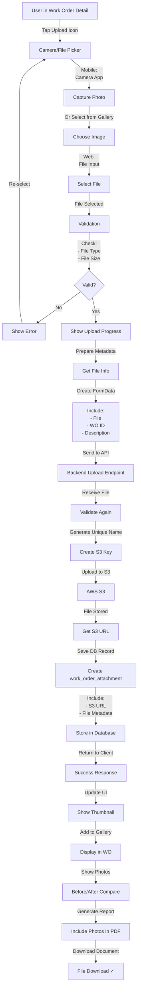
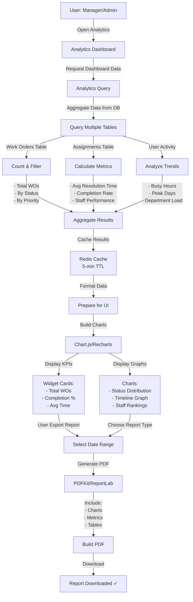
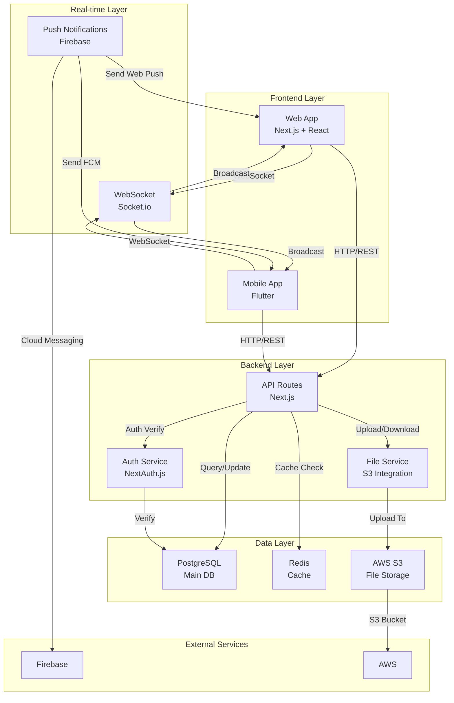

# Work Order Engineering - System Flowcharts

## 1. Work Order Creation & Completion Flow



---

## 2. Assignment & Scheduling Flow



---

## 3. Real-time Update & Notification Flow



---

## 4. Mobile App Offline Sync Flow



---

## 5. Role-Based Access Control (RBAC) Flow



---

## 6. File Upload & Storage Flow



---

## 7. Analytics & Reporting Flow



---

## 8. System Overview - Component Interaction



---

## Flow Summary Table

| Flow | Key Stakeholders | Triggers | Output |
|------|------------------|----------|--------|
| **Work Order Creation** | Staff, Supervisor, Admin | User action | Work order in PENDING status |
| **Assignment** | System, Supervisor, Staff | WO created or reassign | Staff assigned, notification sent |
| **Real-time Update** | All users | Event triggered | Live UI update, push notification |
| **Offline Sync** | Mobile app, Backend | Connection change | Queued actions synced |
| **RBAC** | Auth system, Database | User login | Permissions-based access |
| **File Upload** | User, API, S3 | User selects file | File stored, DB record created |
| **Analytics** | Manager, Admin | View request | Dashboard data, PDF report |

---

## User Journey by Role

### 👨‍💼 Staff Teknis
```
Login → Dashboard → Accept WO → Start Work → Capture Photos →
Add Comments → Mark Complete → Submit → Sync (if offline) ✓
```

### 👔 Supervisor
```
Login → Dashboard → Review WOs → Create Assignment →
Monitor Progress → Approve Completion → View Analytics ✓
```

### 👨‍💻 Admin
```
Login → Dashboard → Manage Users/Roles → Assign Permissions →
Monitor System → View Reports → Generate Analytics ✓
```

### 📊 Manager
```
Login → Analytics Dashboard → View KPIs → Export Reports →
Monitor Team Performance → Make Decisions ✓
```
